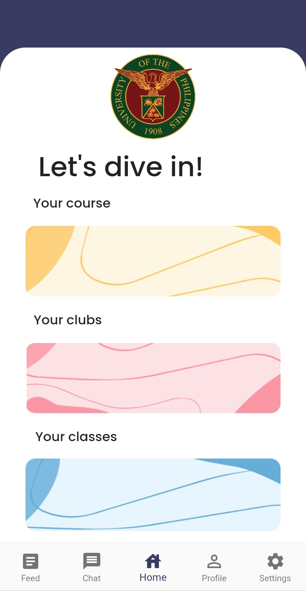
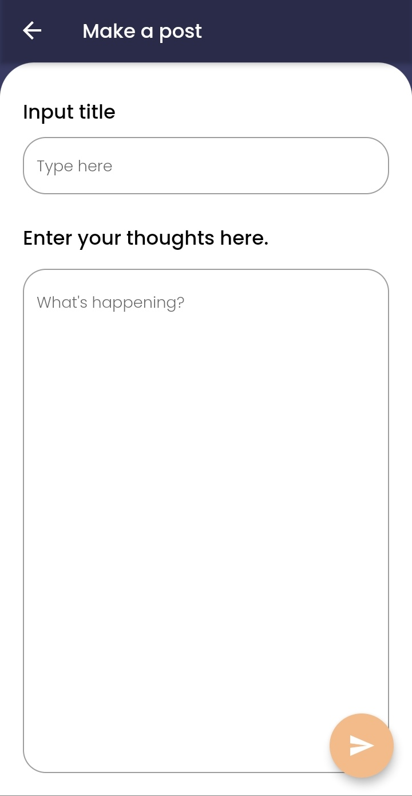
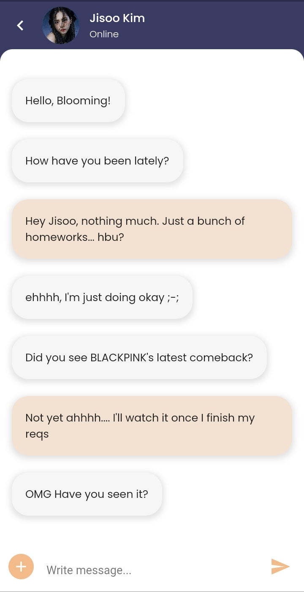
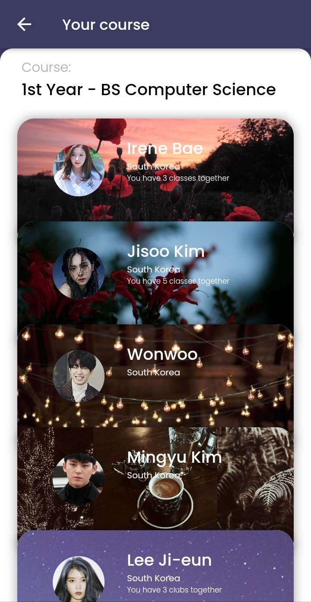
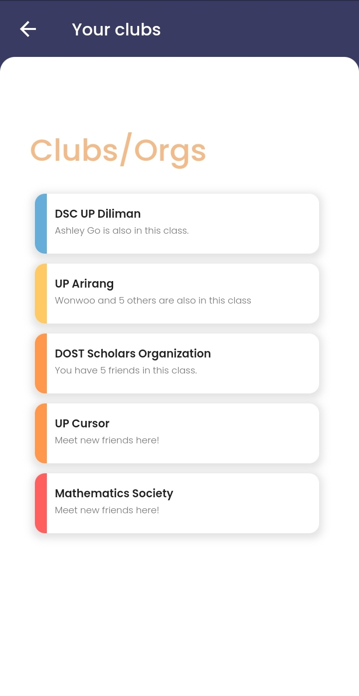
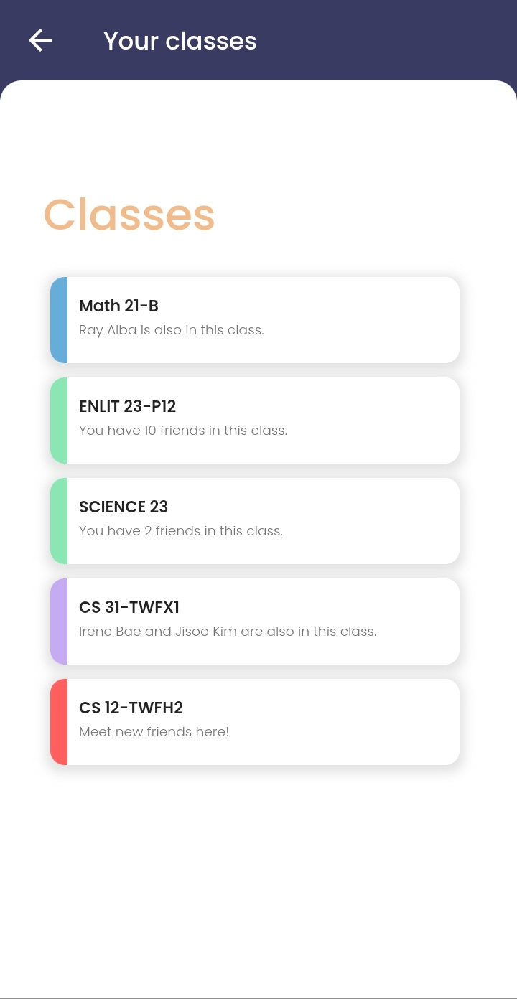

# Kolehi-Niyo

A Flutter prototype made by Green Squad for Diliman Solutions Challenge '21.

## Screenshots

  

  

  

  

## Author(s)
**Ashley Valerie J. Go**\
**Blooming Dan A. Moneda**\
**Renz Samuel G. Gutierrez**\

## Getting Started

**Note**: Make sure your Flutter environment is setup.
#### Installation

In the command terminal, run the following commands:

    $ git clone https://github.com/emrade/flutter-social.git flutter_social
    $ cd flutter_social/
    $ flutter packages get
    $ flutter run
