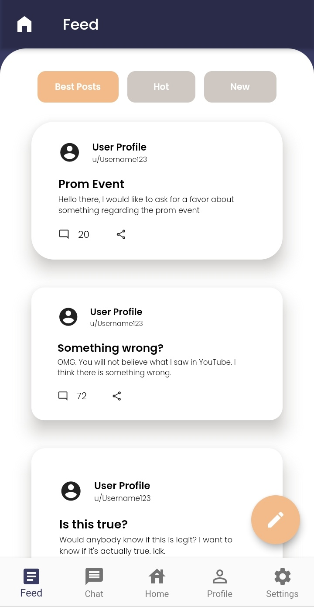
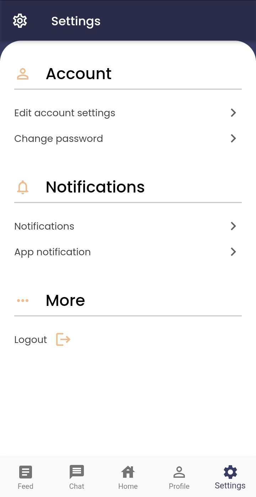

# Kolehi-Niyo

A mobile application project made by team Green Squad with Google's Flutter for Diliman Solutions Challenge '21.

## Screenshots

  

  

  

  

**A full wireframe prototype is also provided at Figma in this [link](https://www.figma.com/file/W0krbAR0KCfsz4HuQeHbBv/Kolehi-Niyo?node-id=221%3A119).**

## Author(s)
**Ashley Valerie J. Go**\
**Blooming Dan A. Moneda**\
**Renz Samuel G. Gutierrez**

## Getting Started 
**Git**: To clone and run this repository, you'll need to install Git.\
Visit Git's [official documentaion](https://git-scm.com/book/en/v2/Getting-Started-Installing-Git) to get started with installation.

**Flutter and Android Studio**: To build and run the project on an emulator or device, you'll need Flutter and Android Studio installed on your computer.\
Visit Flutter's [official documentation](https://flutter.dev/docs/get-started/install) for the complete process.\
Visit Flutter's [official guide](https://flutter.dev/docs/get-started/install/windows#android-setup) to install Android Studio on your computer.

## Installation

Once your device or emulator is connected and recognized by Android Studio, in the command terminal, run the following commands:

    $ git clone https://github.com/bluemberg/kolehi-niyo.git kolehi-niyo
    $ cd kolehi-niyo/
    $ flutter packages get
    $ flutter run

Alternatively, if you prefer to install the full .apk package for your Android device, visit the [releases](https://github.com/bluemberg/kolehi-niyo/releases) page and download the a) .apk compatible with your device's CPU architecture or b) the universal .apk (with -universal suffix) compatible with all Android architectures.

**Note**: Make sure to have an internet connection when running the application, as some of its assets, such as images, are pulled from Internet web sources.
